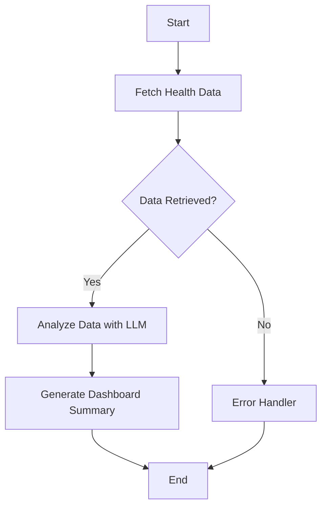

# Public Health Dashboard Agent with LangGraph

This directory contains a complete **LangGraph agent workflow** that demonstrates real-world usage of the FastMCP Public Health server. The agent analyzes health risk trends and alerts to generate comprehensive dashboard summaries for public health officials.

## 🏗️ Architecture

The LangGraph agent follows a state-driven workflow with these components:



### Workflow Nodes

1. **`fetch_health_data_node`**: Connects to FastMCP server and retrieves alerts & trends
2. **`analyze_data_node`**: Uses LLM to analyze patterns and correlations in health data
3. **`generate_summary_node`**: Creates executive-level dashboard summaries
4. **`error_handler_node`**: Handles failures gracefully with actionable error messages

## 🚀 Features

- **Multi-LLM Support**: Works with OpenAI GPT-4 or Anthropic Claude
- **Real-time Health Data**: Fetches live data from the FastMCP server
- **Intelligent Analysis**: LLM-powered pattern recognition and risk assessment
- **Dashboard Ready**: Generates summaries optimized for executive dashboards
- **Error Resilience**: Graceful error handling with diagnostic information
- **Interactive Mode**: CLI interface for testing and demonstration
- **Environment Configuration**: Uses .env files for easy configuration

## 📦 Installation

```bash
# Install dependencies
cd backend/mcp
source venv/bin/activate
pip install -r requirements.txt

# Navigate to agents directory
cd ../app/agents

# Configure environment variables
cp ../.env-template ../.env
# Edit .env file with your configuration:
# - MCP_SERVER_HOST=localhost (or your server host)
# - MCP_SERVER_PORT=8001 (or your server port)
# - OPENAI_API_KEY=your-key (optional)
# - ANTHROPIC_API_KEY=your-key (optional)

# Required: Start the FastMCP server (from the mcp directory)
cd ../../mcp
python3 -m uvicorn mcp_public_health:app --host 0.0.0.0 --port 8001
cd ../app/agents  # Return to agents directory

# Optional: Set API keys for LLM providers
export OPENAI_API_KEY="your-openai-api-key"
# OR
export ANTHROPIC_API_KEY="your-anthropic-api-key"
```

## 🔧 Usage

### Basic Usage

```python
from health_dashboard_agent import PublicHealthDashboardAgent

# Create agent (uses environment variables for configuration)
agent = PublicHealthDashboardAgent()

# Generate dashboard
result = await agent.assemble_dashboard()

# Use the results
print(result["dashboard_summary"])
print(f"Processed {result['alerts_count']} alerts and {result['trends_count']} trends")
```

### Targeted Requests

```python
# Focus on specific dates
result = await agent.assemble_dashboard(...)
```

### Interactive CLI

```bash
# Run interactive dashboard session
python health_dashboard_agent.py interactive

# Available commands:
# - "alerts only" - Focus on current alerts
# - "trends only" - Focus on risk trends
# - "high severity" - High severity issues only
# - "state CA" - Focus on specific state
# - "exit" - Quit
```

## 🧪 Testing

The project includes comprehensive tests that work with or without LLM API keys:

```bash
# Run all tests (from backend/app/agents directory)
python test_dashboard_agent.py

# Test specific components
python test_dashboard_agent.py mcp-only     # Test MCP integration only
python test_dashboard_agent.py mock-llm     # Test workflow with mock LLM
python test_dashboard_agent.py real-llm     # Test with real LLM (requires API key)
python test_dashboard_agent.py demo         # Show usage examples
```

## 📊 Output Example

The agent generates structured dashboard summaries like this:

```
📊 PUBLIC HEALTH DASHBOARD SUMMARY

🚨 CURRENT SITUATION
The public health landscape shows elevated activity across multiple states with
15 active alerts affecting 2.3M people. Respiratory illnesses are trending
upward, requiring immediate attention in high-density areas.

🔥 CRITICAL ALERTS
• HIGH: COVID-19 outbreak in nursing facilities (CA) - 45,000 affected
• HIGH: Foodborne illness cluster (TX) - 12,000 affected
• MEDIUM: Air quality emergency (WA) - 890,000 affected

📈 TREND HIGHLIGHTS
• Respiratory emergency visits ↗️ +23% (concerning)
• Foodborne illness reports ↗️ +15% (monitoring)
• COVID-19 cases ↘️ -5% (improving)

✅ PRIORITY RECOMMENDATIONS
1. Deploy additional testing resources to CA nursing facilities
2. Investigate food supply chain in affected TX regions
3. Issue air quality advisories for Seattle metro area
4. Enhance monitoring for respiratory illness patterns

📊 STATISTICS
• Total Active Alerts: 15
• High Severity: 5
• Population Affected: 2,347,000
• Trend Categories: 8
```

## 🔌 Integration Examples

### Web Dashboard Integration

```python
from flask import Flask, jsonify
from health_dashboard_agent import PublicHealthDashboardAgent

app = Flask(__name__)
agent = PublicHealthDashboardAgent()

@app.route('/api/dashboard')
async def get_dashboard():
    result = await agent.assemble_dashboard()
    return jsonify({
        'summary': result['dashboard_summary'],
        'alerts_count': result['alerts_count'],
        'trends_count': result['trends_count'],
        'timestamp': result['timestamp']
    })
```

### Scheduled Reports

```python
import asyncio
from datetime import datetime
from health_dashboard_agent import PublicHealthDashboardAgent

async def daily_health_report():
    agent = PublicHealthDashboardAgent()

    result = await agent.assemble_dashboard()

    # Save to file, send email, post to Slack, etc.
    with open(f"reports/{datetime.now().strftime('%Y%m%d')}.md", 'w') as f:
        f.write(result['dashboard_summary'])

# Schedule with cron or asyncio
asyncio.run(daily_health_report())
```

### Slack Bot Integration

```python
from slack_sdk.web.async_client import AsyncWebClient
from health_dashboard_agent import PublicHealthDashboardAgent

async def post_health_update(channel_id: str):
    agent = PublicHealthDashboardAgent()
    slack_client = AsyncWebClient(token=os.environ["SLACK_BOT_TOKEN"])

    result = await agent.assemble_dashboard()

    await slack_client.chat_postMessage(
        channel=channel_id,
        text="🏥 Daily Health Dashboard Update",
        blocks=[
            {
                "type": "section",
                "text": {
                    "type": "mrkdwn",
                    "text": result['dashboard_summary']
                }
            }
        ]
    )
```

## 🎛️ Configuration

### Environment Variables

The agent uses the following environment variables for configuration:

```bash
# MCP Server Configuration
MCP_SERVER_HOST=localhost          # Default: localhost
MCP_SERVER_PORT=8001              # Default: 8001

# LLM API Keys (optional - agent works without them in basic mode)
OPENAI_API_KEY=your-openai-key
ANTHROPIC_API_KEY=your-anthropic-key
```

### Setting Up Configuration

1. **Copy the template**:

   ```bash
   cp .env-template .env
   ```

2. **Edit your .env file**:

   ```bash
   # For local development
   MCP_SERVER_HOST=localhost
   MCP_SERVER_PORT=8001
   OPENAI_API_KEY=sk-your-key-here

   # For production
   MCP_SERVER_HOST=mcp.yourcompany.com
   MCP_SERVER_PORT=443
   ```

3. **Load environment variables** (if using python-dotenv):

   ```python
   from dotenv import load_dotenv
   load_dotenv()

   from health_dashboard_agent import PublicHealthDashboardAgent
   agent = PublicHealthDashboardAgent()  # Uses .env config
   ```

### LLM Provider Selection

```python
# Explicit provider selection
agent = PublicHealthDashboardAgent(llm_provider="openai")
agent = PublicHealthDashboardAgent(llm_provider="anthropic")

# Custom LLM configuration
from langchain_openai import ChatOpenAI

agent = PublicHealthDashboardAgent()
agent.llm = ChatOpenAI(
    model="gpt-4o",
    temperature=0.0,  # More deterministic
    api_key="your-key"
)
```

### MCP Server Configuration

```python
# Connect to remote MCP server
agent = PublicHealthDashboardAgent(
    mcp_host="production-server.com",
    mcp_port=8001
)

# Use different MCP endpoints
agent.mcp_client = MultiServerMCPClient({
    "health-server": {
        "url": "https://health-api.gov/mcp",
        "transport": "sse"
    }
})
```

## 🛠️ Customization

### Custom Analysis Prompts

```python
class CustomHealthAgent(PublicHealthDashboardAgent):
    def _create_analysis_prompt(self, alerts_data, trends_data):
        return f"""
        Analyze this health data with focus on:
        1. Pediatric health impacts
        2. Environmental health factors
        3. Health equity considerations

        Data: {json.dumps(alerts_data, indent=2)}
        """
```

### Custom Output Formats

```python
class HTMLDashboardAgent(PublicHealthDashboardAgent):
    async def _generate_summary_node(self, state):
        # Override to generate HTML instead of markdown
        # ... custom HTML generation logic
        pass
```

## 🔍 Monitoring & Debugging

### Enable Debug Logging

```python
import logging
logging.basicConfig(level=logging.DEBUG)

agent = PublicHealthDashboardAgent()
# Will show detailed MCP communication and LLM calls
```

### State Inspection

```python
# Access intermediate state for debugging
workflow = agent.workflow
state_history = await workflow.ainvoke_with_history(initial_state)

for step, state in state_history:
    print(f"Step {step}: {state.keys()}")
```

## 🚨 Error Handling

The agent includes comprehensive error handling:

- **MCP Connection Errors**: Automatic retry with exponential backoff
- **LLM API Errors**: Graceful degradation to cached analysis
- **Data Parsing Errors**: Fallback to structured error messages
- **Timeout Handling**: Configurable timeouts for all operations

## 📚 API Reference

### PublicHealthDashboardAgent

```python
class PublicHealthDashboardAgent:
    def __init__(self, llm_provider: str = "openai",
                 mcp_host: str = "localhost",
                 mcp_port: int = 8001)

    async def assemble_dashboard(self) -> Dict:
        """
        Generate dashboard summary from health data.

        Args: None

        Returns:
            Dict with keys: dashboard_summary, alerts_count, trends_count,
                          timestamp, success, error
        """
```

### DashboardState

```python
class DashboardState(TypedDict):
    messages: List[BaseMessage]          # Conversation history
    current_request: Optional[str]       # Current request being processed
    alerts_data: Optional[Dict]          # Raw alerts from MCP server
    trends_data: Optional[Dict]          # Raw trends from MCP server
    analysis_result: Optional[Dict]      # LLM analysis results
    dashboard_summary: Optional[str]     # Final dashboard summary
    error_message: Optional[str]         # Error details if any
    timestamp: str                       # Generation timestamp
```

## 🤝 Contributing

To extend the agent:

1. **Add New Nodes**: Create new workflow nodes for additional processing
2. **Custom LLM Providers**: Implement new LLM adapters
3. **Output Formats**: Add support for JSON, HTML, or other formats
4. **Data Sources**: Integrate additional MCP servers or APIs

## 📄 License

This project is part of the Public Health MCP Server toolkit. See main project license.

---

**Next Steps**:

- Try the interactive mode: `python health_dashboard_agent.py interactive`
- Run the test suite: `python test_dashboard_agent.py`
- Integrate into your application using the examples above
